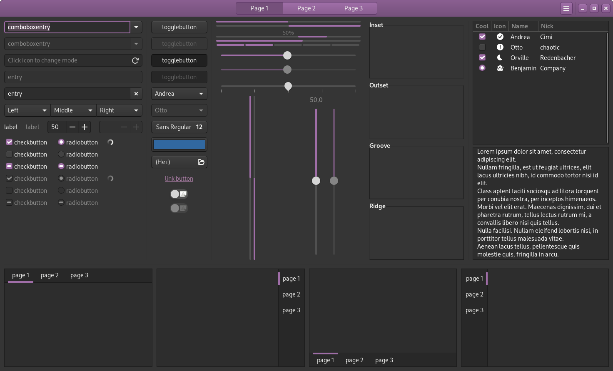
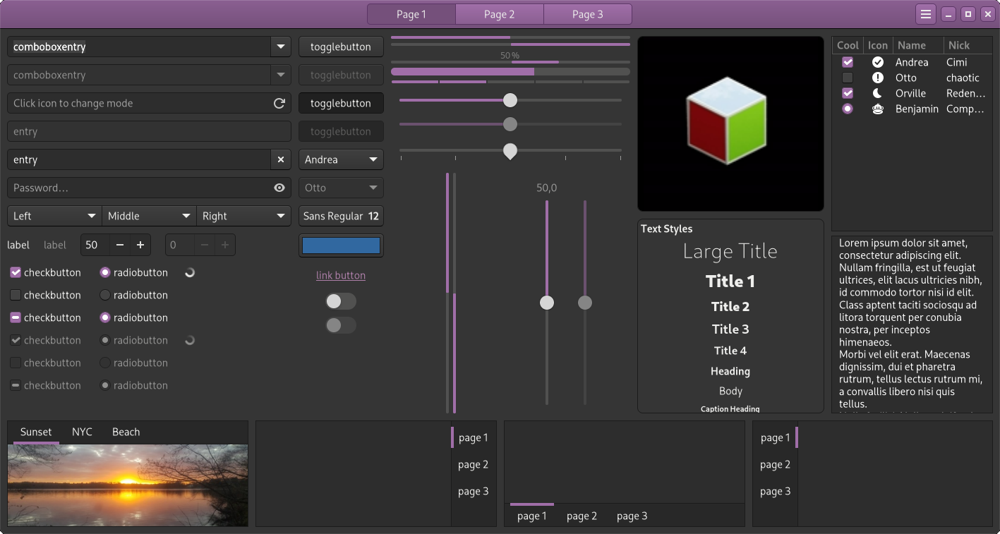

# Modern

A GTK+3/GTK+4 theme, based on Adwaita technology and style from my site.

Changes, what included:

* Recolor accent to my favourite color;
* Tweaks for titlebar/headerbar;
* Tweaks for buttons;
* Toolbar/notebook tweaks.

### Little warning:

Since the beginning of the development of this theme, only the dark version is the most complete. The other variations are given much less attention and may contain much more bugs and underpaints than the main (dark) one. If you notice a bug - **please, create a report and leave it in Issues, preferably with visual information.**

About the full development of all variations: **no, No and again NO.** I don't have that much time or desire to deal with variations of a theme that I don't use myself. Please, understand and step into the situation.

## Known bugs

1. Some accents not recolored (because some backgrounds/borders colored with *rgba(xx, xx, xx, xx)*, this different search);
2. Little bugs in GTK+4 theme with headerbar/titlebar;
3. GTK+4 theme might be bugged, some colors don't changed, etc;
4. What i don't see.

## How to instal

Extract archive with theme, rename folders "Dark" to "Modern", "White" to "Modern-White" and use, what you want.

Color schemes for Qt5Ct/Qt6Ct install to:
* Qt5: ~/.config/qt5ct/colors
* Qt6: ~/.config/qt6ct/colors

Color schemes for KDE Plasma install to:
* ~/.local/share/color-schemes

KWin theme install to:
* ~/.local/share/aurorae/themes

Kvantum theme install to:
* ~/.config/Kvantum

<<<<<<< HEAD
IceWM theme install to:
* ~/.icewm/themes

Fluxbox theme install to:
* ~/.fluxbox/styles

TDE files installation:
* deKorator theme:  ~/.trinity/share/apps/deKorator/themes
* Color scheme: ~/.trinity/share/apps/tdedisplay/color-schemes

Plasma Desktop Theme install to:
* ~/.local.share/plasma/desktoptheme

## Third-party code

* ~~Original Adwaita themes from [libgtk](https://gitlab.gnome.org/GNOME/gtk/) (GTK+3, GTK+2) and [libadwaita](https://gitlab.gnome.org/GNOME/libadwaita) (GTK+4), what exported with widget factories of this toolkits.~~
* Some code i picked from our works -  [Clearlooks Phenix Plume](https://github.com/TerminalHash/clearlooks-phenix-plume) and based on this theme my forks.
* Fully rebased on [Adw-Mod](https://gitlab.com/hrdwrrsk/AdwMod-theme) by hrdwrrsk
* Recolored Metacity theme from TraditionalOk by Daniel Borgmann, Andrea Cimitan
* Forked adwaid theme by zabergan, thanks you!
* Forked Mint-Y cinnamon themes
<<<<<<< HEAD
* Forked KvGnomeDark theme
* Forked ceres-icewm theme
* Forked kdewaita theme

### Why don't you use scss?
I need to see the result here and now, also this format is too convoluted and inconvenient.

## Screenshots

More screenshots on SCREENSHOTS.md!

**GTK+3**

**GTK+4**

