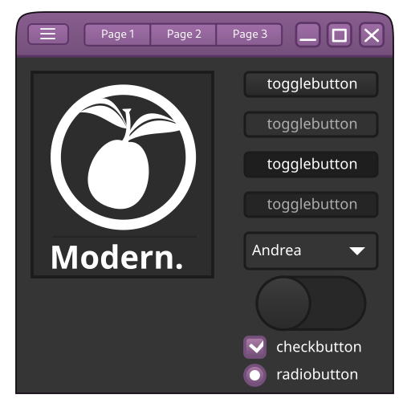

# Modern

A GTK+3/GTK+4 theme, based on Adwaita technology and style from my site.

Changes, what included:

* Recolor accent to my favourite color;
* Tweaks for titlebar/headerbar;
* Tweaks for buttons;
* Toolbar/notebook tweaks.

## Known bugs

1. Some accents not recolored (because some backgrounds/borders colored with *rgb(xx, xx, xx, xx)*, this different search).
2. GTK+2 theme not matching to other (because original theme with different color scheme, then original Adwaita).
3. What i don't see.

## How to instal

Extract archive with theme to ~/themes/Modern.

Color schemes for Qt5Ct/Qt6Ct install to:
* Qt5: ~/.config/qt5ct/colors
* Qt6: ~/.config/qt6ct/colors

## Third-party code

* Original Adwaita themes from [libgtk](https://gitlab.gnome.org/GNOME/gtk/) (GTK+3, GTK+2) and [libadwaita](https://gitlab.gnome.org/GNOME/libadwaita) (GTK+4), what exported with widget factories of this toolkits.
* Some code i picked from our works -  [Clearlooks Phenix Plume](https://github.com/TerminalHash/clearlooks-phenix-plume) and based on this theme my forks.

## Screenshots

**GTK+3**

**GTK+4**

**Comparsion**

