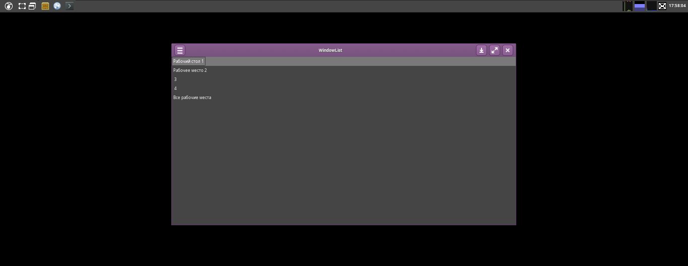

# Modern

A GTK+3/GTK+4 theme, based on Adwaita technology and style from my site.

## Screenshots

### Main:

**Metacity/Mutter/Muffin**

**Metacity without compositor/other WM without compositor**

**Metacity with metacity-deco**

**GTK+3 Widgets**

**GTK+4 Widgets**

### KDE:

**KWin without compositor**

**KWin with compositor**

**Kvantum Preview**

### Window Managers:

**Openbox**

**Fluxbox**

**IceWM**

**XFWM**

**TWin**

### Other:

**Cinnamon theme preview**

